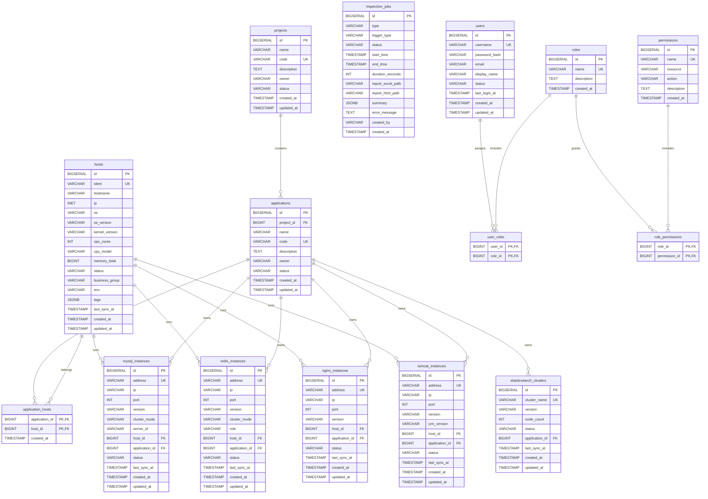
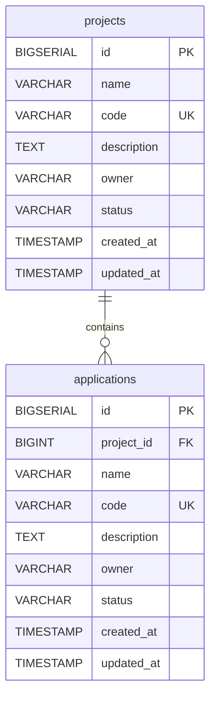
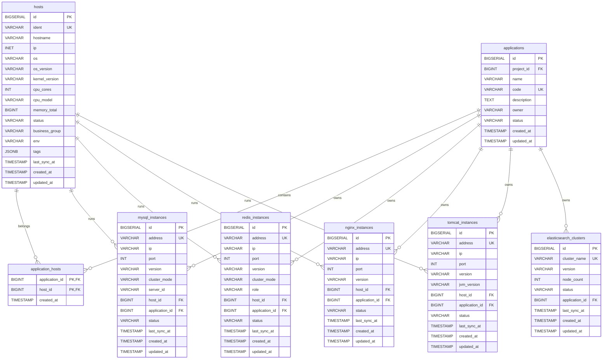
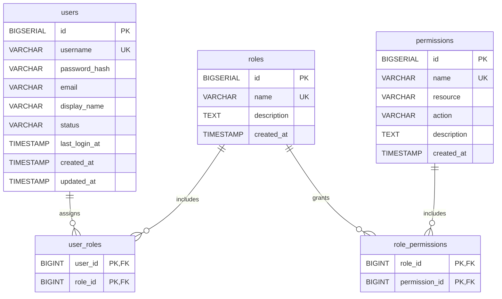

# CMDB 数据库 ERD 文档

## 概述

本文档基于 `cmdb-platform-construction-proposal.md` 中的 SQL 表结构，给出 CMDB 数据库实体关系图（Mermaid erDiagram），并补充分模块视图、索引设计与初始化数据说明，便于研发与评审。

## 完整 ERD 图

## 分模块 ERD 图

### 业务组织结构

### 资产管理

### 用户权限

## 索引设计

- 主键：所有表均使用 `id` 或联合主键（`user_roles`、`role_permissions`、`application_hosts`）作为 PK。
- 唯一索引：
  - `projects.code`、`applications.code`、`hosts.ident`、`mysql_instances.address`、`redis_instances.address`、`nginx_instances.address`、`tomcat_instances.address`、`elasticsearch_clusters.cluster_name`
  - `users.username`、`roles.name`、`permissions.name`
- 普通索引（SQL 已定义）：
  - `applications.project_id`
  - `hosts.ident`、`hosts.ip`、`hosts.business_group`
  - `application_hosts.application_id`、`application_hosts.host_id`
  - `mysql_instances.host_id`
  - `redis_instances.host_id`
  - `inspection_jobs.status`、`inspection_jobs.created_at`

## 初始化数据说明

- 角色初始化：`admin`（系统管理员）、`operator`（运维人员）、`viewer`（只读）。
- 权限初始化：
  - `hosts:read`、`hosts:write`、`hosts:delete`
  - `instances:read`、`instances:write`
  - `inspection:read`、`inspection:create`
  - `users:admin`
- 角色与权限的关联需要后续通过 `role_permissions` 明确配置。
