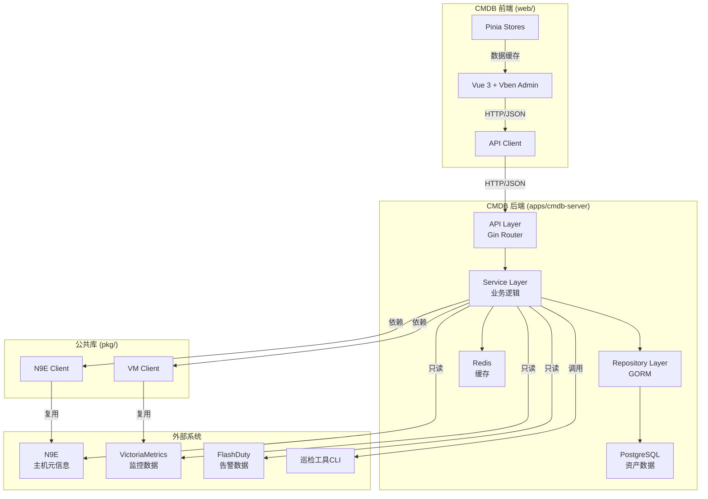

# CMDB-Server 实施计划

> 版本：v1.0
> 创建日期：2026-01-13
> 基于：cmdb-memory 目录下的设计文档和现有巡检工具代码库

---

## 项目概述

### 技术栈摘要

#### 后端技术栈
| 层级 | 技术选型 | 版本 | 用途 |
|-------|---------|------|------|
| **编程语言** | Go | 1.25+ | 核心后端实现 |
| **Web 框架** | Gin | - | HTTP 路由与中间件 |
| **ORM** | GORM | - | 数据库访问层 |
| **权限控制** | Casbin | - | RBAC 权限引擎 |
| **认证** | JWT | - | Token 认证 |
| **密码加密** | bcrypt | - | 密码哈希存储 |
| **日志** | zerolog | - | 结构化日志 |
| **数据库** | PostgreSQL | 14+ | 关系型数据存储 |
| **缓存** | Redis | 6+ | Session 缓存、Token 存储 |

#### 前端技术栈
| 层级 | 技术选型 | 版本 | 用途 |
|-------|---------|------|------|
| **框架** | Vue | 3 | 前端框架 |
| **构建工具** | Vite | - | 构建工具 |
| **UI 框架** | Vben Admin | - | 企业级后台模板 |
| **组件库** | Ant Design Vue | - | UI 组件库 |
| **状态管理** | Pinia | - | 状态管理 |
| **图表库** | ECharts | - | 数据可视化 |
| **类型支持** | TypeScript | - | 类型安全 |

#### 外部系统集成
| 外部系统 | 集成方式 | 用途 | 读写模式 |
|---------|---------|------|---------|
| **N9E（夜莺）** | REST API | 主机元信息同步 | 只读 |
| **VictoriaMetrics** | PromQL API | 监控数据透传 | 只读 |
| **FlashDuty** | Open API | 告警数据展示 | 只读 |
| **巡检工具 CLI** | 命令行调用 | 执行巡检任务 | 调用 |

### 模块划分

#### 后端模块结构
```
apps/cmdb-server/
├── cmd/                      # 程序入口
│   └── main.go
├── internal/
│   ├── api/                  # API 路由与处理器
│   │   ├── handler/         # HTTP 处理器
│   │   ├── middleware/      # 中间件（JWT、Casbin、日志）
│   │   └── router/          # 路由配置
│   ├── model/                # 数据模型（GORM）
│   │   ├── asset.go        # 资产相关模型
│   │   ├── user.go         # 用户权限模型
│   │   └── inspection.go   # 巡检相关模型
│   ├── service/              # 业务逻辑层
│   │   ├── asset/          # 资产管理服务
│   │   ├── monitor/        # 监控透传服务
│   │   ├── alert/          # 告警透传服务
│   │   ├── inspection/     # 巡检管理服务
│   │   └── auth/           # 认证授权服务
│   ├── repository/          # 数据访问层
│   │   ├── host.go
│   │   ├── mysql_instance.go
│   │   └── ...
│   └── proxy/               # 外部 API 代理
│       ├── monitor_proxy.go
│       └── alert_proxy.go
├── configs/                 # 配置文件
├── migrations/              # 数据库迁移脚本
└── go.mod
```

#### 前端模块结构
```
web/apps/web-antd/
├── src/
│   ├── api/                  # API 调用封装
│   ├── assets/               # 静态资源
│   ├── components/           # 通用组件
│   ├── views/                # 页面组件
│   │   ├── cmdb/            # CMDB 模块（新增）
│   │   │   ├── project/     # 项目管理
│   │   │   ├── application/ # 应用管理
│   │   │   ├── host/        # 主机管理
│   │   │   ├── middleware/  # 中间件管理
│   │   │   ├── inspection/  # 巡检管理
│   │   │   └── alert/       # 告警列表
│   │   ├── dashboard/       # 仪表盘
│   │   └── system/          # 系统管理
│   ├── router/               # 路由配置
│   ├── store/                # Pinia 状态管理
│   └── utils/                # 工具函数
└── public/                   # 公共静态资源
```

#### 公共库（pkg/）
```
pkg/
├── n9e/                     # N9E API 客户端（复用 inspect-cli）
├── vm/                      # VictoriaMetrics 客户端（复用 inspect-cli）
├── model/                   # 通用数据模型
└── evaluator/               # 健康评分逻辑
```

### 依赖关系图



---

## 实施阶段总览

| 阶段 | 名称 | 预计耗时 | 前置依赖 |
|------|------|----------|----------|
| **Phase 0** | 环境准备与验证 | 2h | 无 |
| **Phase 1** | 数据层实现 | 4h | Phase 0 |
| **Phase 2** | 服务层实现 | 8h | Phase 1 |
| **Phase 3** | API层实现 | 6h | Phase 2 |
| **Phase 4** | 前端集成 | 12h | Phase 3 |
| **Phase 5** | 测试与部署 | 4h | Phase 4 |

**总预计时间**: 36 小时（约 4-5 个工作日）

---

## 详细步骤

### Phase 0: 环境准备与验证

#### Step 0.1: 验证 Go 环境版本

**目标**：确认 Go 版本满足项目要求（1.25+）

**指令**：
1. 打开终端
2. 执行 Go 版本检查命令
3. 记录输出结果

**验证测试**：
- [ ] 测试命令：`go version`
- [ ] 预期结果：显示 `go version go1.25.x` 或更高版本
- [ ] 回归检查：无

**完成标志**：Go 版本 >= 1.25

**回滚方案**：如版本不符合，下载并安装 Go 1.25+（https://go.dev/dl/）

---

#### Step 0.2: 验证 Node.js 和 npm 环境

**目标**：确认 Node.js 版本满足前端开发要求（建议 18+）

**指令**：
1. 打开终端
2. 执行 Node.js 版本检查命令
3. 执行 npm 版本检查命令

**验证测试**：
- [ ] 测试命令：`node -v`
- [ ] 预期结果：显示 `v18.x.x` 或更高版本
- [ ] 测试命令：`npm -v`
- [ ] 预期结果：显示 npm 版本号
- [ ] 回归检查：无

**完成标志**：Node.js 版本 >= 18，npm 可用

**回滚方案**：如版本不符合，使用 nvm 安装 Node.js 18+（https://github.com/nvm-sh/nvm）

---

#### Step 0.3: 启动 PostgreSQL 数据库

**目标**：确保 PostgreSQL 服务运行并可连接

**指令**：
1. 检查 PostgreSQL 服务状态（使用系统服务管理命令）
2. 如未运行，启动 PostgreSQL 服务
3. 验证数据库连接（使用 psql 或 pgAdmin）

**验证测试**：
- [ ] 测试命令：`pg_isready`（或对应系统的服务状态检查命令）
- [ ] 预期结果：返回 `accepting connections`
- [ ] 回归检查：无

**完成标志**：PostgreSQL 服务运行并接受连接

**回滚方案**：检查 PostgreSQL 日志，修复配置后重启服务

---

#### Step 0.4: 启动 Redis 服务

**目标**：确保 Redis 服务运行并可连接

**指令**：
1. 检查 Redis 服务状态
2. 如未运行，启动 Redis 服务
3. 验证 Redis 连接（使用 redis-cli）

**验证测试**：
- [ ] 测试命令：`redis-cli ping`
- [ ] 预期结果：返回 `PONG`
- [ ] 回归检查：无

**完成标志**：Redis 服务运行并响应 PING

**回滚方案**：检查 Redis 日志，修复配置后重启服务

---

#### Step 0.5: 创建 PostgreSQL 数据库

**目标**：为 CMDB 平台创建专用数据库

**指令**：
1. 使用 PostgreSQL 客户端（psql）连接到数据库服务器
2. 执行创建数据库命令（数据库名称：cmdb）
3. 设置数据库字符集为 UTF-8

**验证测试**：
- [ ] 测试命令：`psql -l | grep cmdb`
- [ ] 预期结果：输出包含 `cmdb` 数据库
- [ ] 回归检查：无

**完成标志**：`cmdb` 数据库已创建

**回滚方案**：执行 `DROP DATABASE cmdb;` 删除数据库

---

#### Step 0.6: 验证外部系统连接性

**目标**：确认 N9E、VictoriaMetrics、FlashDuty 服务可访问

**指令**：
1. 使用 curl 测试 N9E API 端点连接性
2. 使用 curl 测试 VictoriaMetrics API 端点连接性
3. 使用 curl 测试 FlashDuty API 端点连接性

**验证测试**：
- [ ] 测试命令：`curl -I <N9E_URL>/api/n9e/targets`
- [ ] 预期结果：HTTP 200 或 401（需要认证，但服务可达）
- [ ] 测试命令：`curl -I <VM_URL>/api/v1/query`
- [ ] 预期结果：HTTP 200
- [ ] 测试命令：`curl -I <FlashDuty_URL>/open-api/v1/alerts`
- [ ] 预期结果：HTTP 200 或 401
- [ ] 回归检查：无

**完成标志**：所有外部系统 API 可访问

**回滚方案**：检查网络配置、防火墙规则，确保服务地址正确

---

### Phase 1: 数据层实现

#### Step 1.1: 初始化 Go 模块

**目标**：创建 apps/cmdb-server 的 Go 模块配置

**指令**：
1. 进入 apps/cmdb-server 目录
2. 初始化 Go 模块（使用 go mod init 命令）
3. 配置 go.work 文件引用该模块

**验证测试**：
- [ ] 测试命令：`cat apps/cmdb-server/go.mod`
- [ ] 预期结果：包含 `module inspection-tool/apps/cmdb-server`
- [ ] 回归检查：无

**完成标志**：go.mod 文件存在且模块名正确

**回滚方案**：删除 go.mod 和 go.sum 文件，重新初始化

---

#### Step 1.2: 安装 Go 依赖

**目标**：安装后端所需的所有 Go 依赖包

**指令**：
1. 进入 apps/cmdb-server 目录
2. 安装 Gin 框架
3. 安装 GORM 和 PostgreSQL 驱动
4. 安装 Casbin 和相关适配器
5. 安装 JWT、bcrypt、zerolog、viper 等依赖
6. 安装公共库 pkg/n9e 和 pkg/vm（通过 go.work）

**验证测试**：
- [ ] 测试命令：`cat apps/cmdb-server/go.mod | grep -E "gin|gorm|casbin|jwt|bcrypt|zerolog|viper"`
- [ ] 预期结果：go.mod 包含所有必需依赖
- [ ] 回归检查：无

**完成标志**：所有依赖包成功添加到 go.mod

**回滚方案**：删除 go.mod 和 go.sum，重新执行依赖安装

---

#### Step 1.3: 创建数据库模型定义文件

**目标**：创建所有数据表的 GORM 模型定义

**指令**：
1. 在 apps/cmdb-server/internal/model 目录创建 asset.go 文件
2. 定义 Project、Application、Host 结构体
3. 定义 MySQL、Redis、Nginx、Tomcat、ES 实例结构体
4. 在 apps/cmdb-server/internal/model 目录创建 user.go 文件
5. 定义 User、Role、Permission、UserRole、RolePermission 结构体
6. 在 apps/cmdb-server/internal/model 目录创建 inspection.go 文件
7. 定义 InspectionJob 结构体

**验证测试**：
- [ ] 测试命令：`ls -la apps/cmdb-server/internal/model/`
- [ ] 预期结果：显示 asset.go、user.go、inspection.go 文件
- [ ] 回归检查：无

**完成标志**：所有模型文件存在

**回滚方案**：删除创建的模型文件，从 git 恢复

---

#### Step 1.4: 配置数据库连接

**目标**：创建数据库连接配置和初始化代码

**指令**：
1. 在 apps/cmdb-server/internal 目录创建 database.go 文件
2. 编写数据库连接函数（使用 GORM）
3. 配置连接池参数
4. 添加自动迁移代码（AutoMigrate）
5. 在 apps/cmdb-server/configs 目录创建 config.yaml 文件
6. 配置 PostgreSQL 连接参数（host、port、user、password、dbname）

**验证测试**：
- [ ] 测试命令：`cat apps/cmdb-server/internal/database.go | grep -E "gorm.Open|AutoMigrate"`
- [ ] 预期结果：代码包含数据库连接和迁移逻辑
- [ ] 回归检查：无

**完成标志**：数据库连接配置完成

**回滚方案**：删除 database.go 和 config.yaml，从 git 恢复

---

#### Step 1.5: 执行数据库迁移

**目标**：创建所有数据表和索引

**指令**：
1. 在 apps/cmdb-server/cmd/main.go 编写临时迁移执行代码
2. 调用 GORM 的 AutoMigrate 函数，传入所有模型
3. 编译并运行程序
4. 验证数据库表创建情况

**验证测试**：
- [ ] 测试命令：`psql -d cmdb -c "\dt"`
- [ ] 预期结果：输出包含所有表（projects、applications、hosts、users 等）
- [ ] 回归检查：无

**完成标志**：所有表成功创建在 cmdb 数据库

**回滚方案**：执行 `DROP SCHEMA public CASCADE; CREATE SCHEMA public;` 清空数据库

---

#### Step 1.6: 初始化基础数据

**目标**：插入默认角色和权限数据

**指令**：
1. 在 apps/cmdb-server/internal/model 目录创建 init.go 文件
2. 编写初始化函数，创建 admin、operator、viewer 角色
3. 创建基础权限定义（hosts:read、hosts:write、inspection:create 等）
4. 在 main.go 启动时调用初始化函数

**验证测试**：
- [ ] 测试命令：`psql -d cmdb -c "SELECT name FROM roles;"`
- [ ] 预期结果：输出包含 admin、operator、viewer
- [ ] 回归检查：无

**完成标志**：默认角色和权限数据已创建

**回滚方案**：手动删除 roles 和 permissions 表数据

---

#### Step 1.7: 创建 Repository 接口定义

**目标**：定义数据访问层的接口规范

**指令**：
1. 在 apps/cmdb-server/internal/repository 目录创建 repository.go 文件
2. 定义通用 Repository 接口（Create、Update、Delete、FindByID、List）
3. 为每个实体定义专用 Repository 接口（如 HostRepository、ProjectRepository）

**验证测试**：
- [ ] 测试命令：`cat apps/cmdb-server/internal/repository/repository.go | grep "type.*Repository interface"`
- [ ] 预期结果：显示所有 Repository 接口定义
- [ ] 回归检查：无

**完成标志**：Repository 接口定义完成

**回滚方案**：删除 repository.go 文件

---

#### Step 1.8: 实现 Repository 层

**目标**：实现所有 Repository 接口的具体逻辑

**指令**：
1. 为每个实体创建对应的 Repository 实现文件（如 host.go、project.go）
2. 使用 GORM 实现 CRUD 操作
3. 实现分页查询功能
4. 实现条件过滤功能（如按业务组、环境筛选主机）

**验证测试**：
- [ ] 测试命令：`ls -la apps/cmdb-server/internal/repository/ | grep "\.go"`
- [ ] 预期结果：显示所有 Repository 实现文件
- [ ] 回归检查：无

**完成标志**：所有 Repository 接口已实现

**回滚方案**：删除 Repository 实现文件，从 git 恢复

---

### Phase 2: 服务层实现

#### Step 2.1: 实现认证服务

**目标**：实现用户登录、Token 生成和验证逻辑

**指令**：
1. 在 apps/cmdb-server/internal/service/auth 目录创建 auth_service.go 文件
2. 实现登录函数（验证用户名密码，生成 JWT Token）
3. 实现 Token 验证函数（解析 JWT，提取用户信息）
4. 实现 Token 刷新函数
5. 实现密码哈希函数（使用 bcrypt）

**验证测试**：
- [ ] 测试命令：`cat apps/cmdb-server/internal/service/auth/auth_service.go | grep -E "Login|GenerateToken|ValidateToken"`
- [ ] 预期结果：代码包含所有认证相关函数
- [ ] 回归检查：无

**完成标志**：认证服务函数实现完成

**回滚方案**：删除 auth_service.go 文件

---

#### Step 2.2: 实现用户服务

**目标**：实现用户 CRUD 和角色分配逻辑

**指令**：
1. 在 apps/cmdb-server/internal/service/user 目录创建 user_service.go 文件
2. 实现创建用户函数（密码哈希、角色关联）
3. 实现更新用户函数
4. 实现删除用户函数
5. 实现用户列表查询函数（分页、过滤）

**验证测试**：
- [ ] 测试命令：`cat apps/cmdb-server/internal/service/user/user_service.go | grep -E "CreateUser|UpdateUser|DeleteUser|ListUsers"`
- [ ] 预期结果：代码包含所有用户管理函数
- [ ] 回归检查：无

**完成标志**：用户服务函数实现完成

**回滚方案**：删除 user_service.go 文件

---

#### Step 2.3: 实现角色服务

**目标**：实现角色 CRUD 和权限分配逻辑

**指令**：
1. 在 apps/cmdb-server/internal/service/role 目录创建 role_service.go 文件
2. 实现创建角色函数
3. 实现更新角色函数
4. 实现删除角色函数
5. 实现角色列表查询函数
6. 实现权限分配函数

**验证测试**：
- [ ] 测试命令：`cat apps/cmdb-server/internal/service/role/role_service.go | grep -E "CreateRole|UpdateRole|DeleteRole|AssignPermissions"`
- [ ] 预期结果：代码包含所有角色管理函数
- [ ] 回归检查：无

**完成标志**：角色服务函数实现完成

**回滚方案**：删除 role_service.go 文件

---

#### Step 2.4: 实现主机同步服务

**目标**：实现从 N9E 同步主机元信息的逻辑

**指令**：
1. 在 apps/cmdb-server/internal/service/sync 目录创建 host_sync_service.go 文件
2. 调用 pkg/n9e 客户端获取主机列表
3. 解析主机元信息（ident、hostname、ip、os、cpu、memory）
4. 实现主机数据同步逻辑（对比数据库，新增/更新/删除）
5. 更新 last_sync_at 时间戳

**验证测试**：
- [ ] 测试命令：`cat apps/cmdb-server/internal/service/sync/host_sync_service.go | grep -E "n9e.Client|SyncHosts"`
- [ ] 预期结果：代码包含 N9E 客户端调用和同步逻辑
- [ ] 回归检查：无

**完成标志**：主机同步服务函数实现完成

**回滚方案**：删除 host_sync_service.go 文件

---

#### Step 2.5: 实现中间件实例发现服务

**目标**：实现从 VictoriaMetrics 发现中间件实例的逻辑

**指令**：
1. 在 apps/cmdb-server/internal/service/sync 目录创建 instance_discovery_service.go 文件
2. 构建 PromQL 查询（mysql_up、redis_up、nginx_up、tomcat_up、es_cluster_health）
3. 调用 pkg/vm 客户端查询实例信息
4. 解析实例数据（address、version、cluster_mode）
5. 关联到对应的主机（通过 ident 标签）
6. 写入数据库（mysql_instances、redis_instances 等）

**验证测试**：
- [ ] 测试命令：`cat apps/cmdb-server/internal/service/sync/instance_discovery_service.go | grep -E "vm.Client|Query|mysql_up|redis_up"`
- [ ] 预期结果：代码包含 VM 客户端调用和实例发现逻辑
- [ ] 回归检查：无

**完成标志**：中间件实例发现服务函数实现完成

**回滚方案**：删除 instance_discovery_service.go 文件

---

#### Step 2.6: 实现资产管理服务

**目标**：实现项目和应用的 CRUD 逻辑

**指令**：
1. 在 apps/cmdb-server/internal/service/asset 目录创建 asset_service.go 文件
2. 实现项目 CRUD 函数
3. 实现应用 CRUD 函数
4. 实现主机 CRUD 函数
5. 实现应用-主机关联逻辑
6. 实现中间件实例 CRUD 函数

**验证测试**：
- [ ] 测试命令：`cat apps/cmdb-server/internal/service/asset/asset_service.go | grep -E "CreateProject|UpdateProject|CreateApplication|CreateHost"`
- [ ] 预期结果：代码包含所有资产管理函数
- [ ] 回归检查：无

**完成标志**：资产管理服务函数实现完成

**回滚方案**：删除 asset_service.go 文件

---

#### Step 2.7: 实现监控透传服务

**目标**：实现监控数据查询透传逻辑

**指令**：
1. 在 apps/cmdb-server/internal/proxy 目录创建 monitor_proxy.go 文件
2. 实现实时指标查询函数（透传 VM /api/v1/query）
3. 实现历史趋势查询函数（透传 VM /api/v1/query_range）
4. 格式化返回数据（转换为前端 ECharts 格式）
5. 处理查询失败错误

**验证测试**：
- [ ] 测试命令：`cat apps/cmdb-server/internal/proxy/monitor_proxy.go | grep -E "Query|QueryRange|ECharts"`
- [ ] 预期结果：代码包含监控透传函数
- [ ] 回归检查：无

**完成标志**：监控透传服务函数实现完成

**回滚方案**：删除 monitor_proxy.go 文件

---

#### Step 2.8: 实现告警透传服务

**目标**：实现告警数据只读代理逻辑

**指令**：
1. 在 apps/cmdb-server/internal/proxy 目录创建 alert_proxy.go 文件
2. 实现 FlashDuty 告警列表查询函数
3. 实现 FlashDuty 故障列表查询函数
4. 实现告警详情查询函数
5. 配置 API Key 认证

**验证测试**：
- [ ] 测试命令：`cat apps/cmdb-server/internal/proxy/alert_proxy.go | grep -E "FlashDuty|Alerts|Incidents"`
- [ ] 预期结果：代码包含告警透传函数
- [ ] 回归检查：无

**完成标志**：告警透传服务函数实现完成

**回滚方案**：删除 alert_proxy.go 文件

---

#### Step 2.9: 实现巡检管理服务

**目标**：实现巡检任务触发和管理逻辑

**指令**：
1. 在 apps/cmdb-server/internal/service/inspection 目录创建 inspect_service.go 文件
2. 实现创建巡检任务函数（生成 InspectJob 记录）
3. 实现异步执行 inspect-cli 的逻辑（使用 exec.Command）
4. 实现更新任务状态的函数
5. 实现巡检报告存储逻辑（文件路径写入数据库）

**验证测试**：
- [ ] 测试命令：`cat apps/cmdb-server/internal/service/inspection/inspect_service.go | grep -E "CreateJob|exec.Command|UpdateStatus"`
- [ ] 预期结果：代码包含巡检管理函数
- [ ] 回归检查：无

**完成标志**：巡检管理服务函数实现完成

**回滚方案**：删除 inspect_service.go 文件

---

#### Step 2.10: 配置 Casbin 权限模型

**目标**：创建 Casbin RBAC 策略模型文件

**指令**：
1. 在 apps/cmdb-server/configs 目录创建 casbin_model.conf 文件
2. 定义 RBAC 模型（role_definition、policy_definition、matchers）
3. 在 apps/cmdb-server/configs 目录创建 casbin_policy.csv 文件
4. 定义初始权限策略（admin、operator、viewer 角色）

**验证测试**：
- [ ] 测试命令：`cat apps/cmdb-server/configs/casbin_model.conf | grep -E "\[request_definition\]|\[role_definition\]|\[matchers\]"`
- [ ] 预期结果：Casbin 模型定义完整
- [ ] 回归检查：无

**完成标志**：Casbin 模型和策略文件创建完成

**回滚方案**：删除 casbin_model.conf 和 casbin_policy.csv

---

### Phase 3: API层实现

#### Step 3.1: 创建 Gin 路由器

**目标**：配置 HTTP 路由和中间件

**指令**：
1. 在 apps/cmdb-server/internal/api/router 目录创建 router.go 文件
2. 初始化 Gin 路由引擎
3. 配置全局中间件（日志、CORS、错误处理）
4. 创建路由组（/api/v1）
5. 注册所有子路由

**验证测试**：
- [ ] 测试命令：`cat apps/cmdb-server/internal/api/router/router.go | grep -E "gin.New|Use|Group"`
- [ ] 预期结果：代码包含路由初始化和中间件配置
- [ ] 回归检查：无

**完成标志**：Gin 路由器配置完成

**回滚方案**：删除 router.go 文件

---

#### Step 3.2: 实现认证中间件

**目标**：创建 JWT Token 验证中间件

**指令**：
1. 在 apps/cmdb-server/internal/api/middleware 目录创建 auth.go 文件
2. 实现 JWT Token 解析和验证函数
3. 提取用户信息并注入到上下文
4. 处理 Token 过期和无效情况
5. 返回 401 错误响应

**验证测试**：
- [ ] 测试命令：`cat apps/cmdb-server/internal/api/middleware/auth.go | grep -E "JWT|Token|401"`
- [ ] 预期结果：代码包含 JWT 验证逻辑
- [ ] 回归检查：无

**完成标志**：认证中间件实现完成

**回滚方案**：删除 auth.go 文件

---

#### Step 3.3: 实现授权中间件

**目标**：创建 Casbin 权限检查中间件

**指令**：
1. 在 apps/cmdb-server/internal/api/middleware 目录创建 casbin.go 文件
2. 初始化 Casbin Enforcer
3. 实现权限检查函数（从上下文提取用户和资源）
4. 调用 Casbin API 验证权限
5. 返回 403 错误响应

**验证测试**：
- [ ] 测试命令：`cat apps/cmdb-server/internal/api/middleware/casbin.go | grep -E "casbin.Enforce|403"`
- [ ] 预期结果：代码包含权限检查逻辑
- [ ] 回归检查：无

**完成标志**：授权中间件实现完成

**回滚方案**：删除 casbin.go 文件

---

#### Step 3.4: 实现健康检查端点

**目标**：创建 /health 健康检查接口

**指令**：
1. 在 apps/cmdb-server/internal/api/handler 目录创建 health.go 文件
2. 创建健康检查处理函数
3. 检查数据库连接状态
4. 检查 Redis 连接状态
5. 返回 JSON 响应

**验证测试**：
- [ ] 测试命令：`cat apps/cmdb-server/internal/api/handler/health.go | grep -E "HealthCheck|status"`
- [ ] 预期结果：代码包含健康检查函数
- [ ] 回归检查：无

**完成标志**：健康检查端点实现完成

**回滚方案**：删除 health.go 文件

---

#### Step 3.5: 实现认证相关端点

**目标**：创建登录、登出、刷新 Token 接口

**指令**：
1. 在 apps/cmdb-server/internal/api/handler 目录创建 auth.go 文件
2. 实现 POST /api/v1/auth/login 端点
3. 实现 POST /api/v1/auth/logout 端点
4. 实现 POST /api/v1/auth/refresh 端点
5. 在 router.go 注册这些路由

**验证测试**：
- [ ] 测试命令：`cat apps/cmdb-server/internal/api/handler/auth.go | grep -E "Login|Logout|Refresh"`
- [ ] 预期结果：代码包含所有认证端点处理函数
- [ ] 回归检查：无

**完成标志**：认证相关端点实现完成

**回滚方案**：删除 auth.go 文件

---

#### Step 3.6: 实现用户管理端点

**目标**：创建用户 CRUD 接口

**指令**：
1. 在 apps/cmdb-server/internal/api/handler 目录创建 user.go 文件
2. 实现 GET /api/v1/users（列表）
3. 实现 POST /api/v1/users（创建）
4. 实现 GET /api/v1/users/:id（详情）
5. 实现 PUT /api/v1/users/:id（更新）
6. 实现 DELETE /api/v1/users/:id（删除）
7. 在 router.go 注册这些路由

**验证测试**：
- [ ] 测试命令：`cat apps/cmdb-server/internal/api/handler/user.go | grep -E "ListUsers|CreateUser|GetUser|UpdateUser|DeleteUser"`
- [ ] 预期结果：代码包含所有用户管理端点处理函数
- [ ] 回归检查：无

**完成标志**：用户管理端点实现完成

**回滚方案**：删除 user.go 文件

---

#### Step 3.7: 实现角色管理端点

**目标**：创建角色 CRUD 接口

**指令**：
1. 在 apps/cmdb-server/internal/api/handler 目录创建 role.go 文件
2. 实现 GET /api/v1/roles（列表）
3. 实现 POST /api/v1/roles（创建）
4. 实现 GET /api/v1/roles/:id（详情）
5. 实现 PUT /api/v1/roles/:id（更新）
6. 实现 DELETE /api/v1/roles/:id（删除）
7. 在 router.go 注册这些路由

**验证测试**：
- [ ] 测试命令：`cat apps/cmdb-server/internal/api/handler/role.go | grep -E "ListRoles|CreateRole|GetRole|UpdateRole|DeleteRole"`
- [ ] 预期结果：代码包含所有角色管理端点处理函数
- [ ] 回归检查：无

**完成标志**：角色管理端点实现完成

**回滚方案**：删除 role.go 文件

---

#### Step 3.8: 实现资产管理端点

**目标**：创建项目、应用、主机、中间件实例 CRUD 接口

**指令**：
1. 在 apps/cmdb-server/internal/api/handler 目录创建 asset.go 文件
2. 实现项目管理端点（GET/POST/PUT/DELETE /api/v1/projects）
3. 实现应用管理端点（GET/POST/PUT/DELETE /api/v1/applications）
4. 实现主机管理端点（GET/POST/PUT/DELETE /api/v1/hosts）
5. 实现主机同步端点（POST /api/v1/hosts/sync）
6. 实现主机监控查询端点（GET /api/v1/hosts/:id/metrics）
7. 实现中间件实例管理端点（MySQL、Redis、Nginx、Tomcat、ES）
8. 在 router.go 注册这些路由

**验证测试**：
- [ ] 测试命令：`cat apps/cmdb-server/internal/api/handler/asset.go | grep -E "ListProjects|CreateProject|ListHosts|SyncHosts|ListMySQLInstances"`
- [ ] 预期结果：代码包含所有资产管理端点处理函数
- [ ] 回归检查：无

**完成标志**：资产管理端点实现完成

**回滚方案**：删除 asset.go 文件

---

#### Step 3.9: 实现监控透传端点

**目标**：创建监控数据查询接口

**指令**：
1. 在 apps/cmdb-server/internal/api/handler 目录创建 monitor.go 文件
2. 实现 GET /api/v1/monitor/query（实时查询）
3. 实现 GET /api/v1/monitor/query_range（历史趋势）
4. 参数绑定（query、start、end、step）
5. 调用 MonitorProxy 服务
6. 在 router.go 注册这些路由

**验证测试**：
- [ ] 测试命令：`cat apps/cmdb-server/internal/api/handler/monitor.go | grep -E "QueryMetrics|QueryRange|MonitorProxy"`
- [ ] 预期结果：代码包含监控透传端点处理函数
- [ ] 回归检查：无

**完成标志**：监控透传端点实现完成

**回滚方案**：删除 monitor.go 文件

---

#### Step 3.10: 实现告警透传端点

**目标**：创建告警数据查询接口

**指令**：
1. 在 apps/cmdb-server/internal/api/handler 目录创建 alert.go 文件
2. 实现 GET /api/v1/alerts（告警列表）
3. 实现 GET /api/v1/alerts/:id（告警详情）
4. 实现 GET /api/v1/incidents（故障列表）
5. 实现 GET /api/v1/incidents/:id（故障详情）
6. 调用 AlertProxy 服务
7. 在 router.go 注册这些路由

**验证测试**：
- [ ] 测试命令：`cat apps/cmdb-server/internal/api/handler/alert.go | grep -E "ListAlerts|GetAlert|ListIncidents|AlertProxy"`
- [ ] 预期结果：代码包含告警透传端点处理函数
- [ ] 回归检查：无

**完成标志**：告警透传端点实现完成

**回滚方案**：删除 alert.go 文件

---

#### Step 3.11: 实现巡检管理端点

**目标**：创建巡检任务管理接口

**指令**：
1. 在 apps/cmdb-server/internal/api/handler 目录创建 inspection.go 文件
2. 实现 GET /api/v1/inspection/jobs（任务列表）
3. 实现 POST /api/v1/inspection/jobs（触发巡检）
4. 实现 GET /api/v1/inspection/jobs/:id（任务详情）
5. 实现 DELETE /api/v1/inspection/jobs/:id（删除任务）
6. 调用 InspectService 服务
7. 在 router.go 注册这些路由

**验证测试**：
- [ ] 测试命令：`cat apps/cmdb-server/internal/api/handler/inspection.go | grep -E "ListJobs|CreateJob|GetJob|DeleteJob|InspectService"`
- [ ] 预期结果：代码包含巡检管理端点处理函数
- [ ] 回归检查：无

**完成标志**：巡检管理端点实现完成

**回滚方案**：删除 inspection.go 文件

---

#### Step 3.12: 创建统一错误处理中间件

**目标**：实现全局错误处理和统一响应格式

**指令**：
1. 在 apps/cmdb-server/internal/api/middleware 目录创建 error.go 文件
2. 定义错误码常量（0、1001、1002、2001、2002、2003、3001、4001、5001、5002、5003）
3. 实现错误响应格式化函数
4. 注册 Gin 错误处理中间件
5. 处理各类错误（参数错误、认证错误、权限错误、数据库错误）

**验证测试**：
- [ ] 测试命令：`cat apps/cmdb-server/internal/api/middleware/error.go | grep -E "Code|Message|Error"`
- [ ] 预期结果：代码包含错误处理和响应格式化逻辑
- [ ] 回归检查：无

**完成标志**：统一错误处理中间件实现完成

**回滚方案**：删除 error.go 文件

---

### Phase 4: 前端集成

#### Step 4.1: 基于 web-antd 添加 CMDB 模块

**目标**：在现有 Vben Admin (web-antd) 项目中添加 CMDB 模块

**指令**：
1. 进入 web/apps/web-antd 目录
2. 创建 CMDB 模块目录结构：src/views/cmdb/
3. 添加子目录：project/、application/、host/、middleware/、inspection/、alert/
4. 配置路由：src/router/routes/modules/cmdb.ts
5. 验证项目结构

**验证测试**：
- [ ] 测试命令：`ls -la web/apps/web-antd/src/views/cmdb/`
- [ ] 预期结果：显示 project、application、host、middleware 等子目录
- [ ] 回归检查：现有 web-antd 功能正常

**完成标志**：CMDB 模块目录结构创建完成

**回滚方案**：删除 src/views/cmdb 目录和相关路由配置

---

#### Step 4.2: 验证前端依赖

**目标**：验证 web-antd 项目已包含所需依赖

**指令**：
1. 进入 web/apps/web-antd 目录
2. 验证 package.json 包含 Vue Router、Pinia、Ant Design Vue、ECharts、axios
3. 如有缺失，使用 pnpm 安装
4. 执行 pnpm install 确保依赖完整

**验证测试**：
- [ ] 测试命令：`cat web/apps/web-antd/package.json | grep -E "vue-router|pinia|ant-design-vue|echarts|axios"`
- [ ] 预期结果：package.json 包含所有必需依赖
- [ ] 回归检查：现有功能正常

**完成标志**：所有前端依赖验证完成

**回滚方案**：删除 node_modules，重新执行 pnpm install

---

#### Step 4.3: 生成 TypeScript API 客户端

**目标**：基于 OpenAPI 规范生成前端 API 调用代码

**指令**：
1. 使用 openapi-generator-cli 工具
2. 输入 cmdb-memory/api/openapi.yaml
3. 生成 TypeScript + axios 客户端代码
4. 将生成的代码放置在 web/src/api 目录
5. 验证生成的文件

**验证测试**：
- [ ] 测试命令：`ls -la web/src/api/`
- [ ] 预期结果：显示生成的 API 客户端文件
- [ ] 回归检查：无

**完成标志**：TypeScript API 客户端生成完成

**回滚方案**：删除 web/src/api 目录，重新生成

---

#### Step 4.4: 配置 Axios 拦截器

**目标**：配置 HTTP 请求/响应拦截器

**指令**：
1. 在 web/src/utils 目录创建 axios.ts 文件
2. 配置 axios 实例（baseURL、timeout）
3. 实现请求拦截器（自动添加 Authorization 头）
4. 实现响应拦截器（统一错误处理、Token 过期刷新）
5. 导出 axios 实例

**验证测试**：
- [ ] 测试命令：`cat web/src/utils/axios.ts | grep -E "interceptors|Authorization|Error"`
- [ ] 预期结果：代码包含拦截器配置
- [ ] 回归检查：无

**完成标志**：Axios 拦截器配置完成

**回滚方案**：删除 axios.ts 文件

---

#### Step 4.5: 配置 Pinia Store

**目标**：创建 Pinia 状态管理 Stores

**指令**：
1. 在 web/src/store 目录创建 user.ts 文件
2. 实现用户信息状态管理（登录状态、用户信息、Token）
3. 在 web/src/store 目录创建 app.ts 文件
4. 实现应用全局配置状态
5. 在 web/src/store 目录创建 permission.ts 文件
6. 实现路由权限和菜单状态
7. 在 web/src/store 目录创建 index.ts 文件
8. 导出所有 Stores

**验证测试**：
- [ ] 测试命令：`ls -la web/src/store/`
- [ ] 预期结果：显示 user.ts、app.ts、permission.ts、index.ts 文件
- [ ] 回归检查：无

**完成标志**：Pinia Stores 配置完成

**回滚方案**：删除 web/src/store 目录，重新创建

---

#### Step 4.6: 配置 Vue Router

**目标**：配置前端路由和路由守卫

**指令**：
1. 在 web/src/router 目录创建 index.ts 文件
2. 定义路由配置（登录页、仪表盘、资产管理、监控、告警、巡检、系统管理）
3. 配置路由懒加载
4. 实现路由守卫（权限验证、登录重定向）
5. 导出 router 实例

**验证测试**：
- [ ] 测试命令：`cat web/src/router/index.ts | grep -E "routes|beforeEach|Login|Dashboard"`
- [ ] 预期结果：代码包含路由配置和守卫
- [ ] 回归检查：无

**完成标志**：Vue Router 配置完成

**回滚方案**：删除 web/src/router 目录，重新创建

---

#### Step 4.7: 实现登录页面

**目标**：创建用户登录界面

**指令**：
1. 在 web/apps/web-antd/src/views 目录创建 login 目录
2. 创建 Login.vue 文件
3. 使用 Ant Design Vue 表单组件
4. 实现登录表单（用户名、密码）
5. 调用登录 API
6. 登录成功后存储 Token 和用户信息到 Pinia Store
7. 跳转到仪表盘页面

**验证测试**：
- [ ] 测试命令：`ls -la web/apps/web-antd/src/views/login/`
- [ ] 预期结果：显示 Login.vue 文件
- [ ] 回归检查：无

**完成标志**：登录页面实现完成

**回滚方案**：删除 web/apps/web-antd/src/views/login 目录

---

#### Step 4.8: 实现仪表盘页面

**目标**：创建总览仪表盘界面

**指令**：
1. 在 web/apps/web-antd/src/views 目录创建 dashboard 目录
2. 创建 Dashboard.vue 文件
3. 使用 Vben Admin 页面模板
4. 实现 5 个统计卡片（主机数、中间件数、告警数、巡检任务数）
5. 实现 ECharts 资产分布饼图
6. 实现 ECharts 告警趋势折线图
7. 实现最近告警列表

**验证测试**：
- [ ] 测试命令：`ls -la web/apps/web-antd/src/views/dashboard/`
- [ ] 预期结果：显示 Dashboard.vue 文件
- [ ] 回归检查：无

**完成标志**：仪表盘页面实现完成

**回滚方案**：删除 web/apps/web-antd/src/views/dashboard 目录

---

#### Step 4.9: 实现主机管理页面

**目标**：创建主机列表和详情页面

**指令**：
1. 在 web/apps/web-antd/src/views/asset 目录创建 host 目录
2. 创建 HostList.vue 文件
3. 使用 Vben Admin 列表页模板
4. 实现主机列表（分页、搜索、筛选）
5. 实现主机同步按钮（调用同步 API）
6. 创建 HostDetail.vue 文件
7. 实现主机详情页（基本信息 + 监控图表）

**验证测试**：
- [ ] 测试命令：`ls -la web/apps/web-antd/src/views/asset/host/`
- [ ] 预期结果：显示 HostList.vue 和 HostDetail.vue 文件
- [ ] 回归检查：无

**完成标志**：主机管理页面实现完成

**回滚方案**：删除 web/apps/web-antd/src/views/asset/host 目录

---

#### Step 4.10: 实现中间件管理页面

**目标**：创建 MySQL、Redis、Nginx、Tomcat、ES 列表页面

**指令**：
1. 在 web/apps/web-antd/src/views/asset/middleware 目录创建对应子目录
2. 创建 MySQLList.vue、RedisList.vue、NginxList.vue、TomcatList.vue、ESList.vue 文件
3. 使用 Vben Admin 列表页模板
4. 实现中间件实例列表（分页、搜索）
5. 实现实例详情弹窗

**验证测试**：
- [ ] 测试命令：`ls -la web/apps/web-antd/src/views/asset/middleware/`
- [ ] 预期结果：显示所有中间件列表文件
- [ ] 回归检查：无

**完成标志**：中间件管理页面实现完成

**回滚方案**：删除 web/apps/web-antd/src/views/asset/middleware 目录

---

#### Step 4.11: 实现监控查询页面

**目标**：创建 PromQL 查询和监控图表展示页面

**指令**：
1. 在 web/apps/web-antd/src/views/monitor 目录创建 query.vue 文件
2. 使用 Ant Design Vue 表单组件
3. 实现 PromQL 输入框
4. 实现时间范围选择器
5. 实现 ECharts 图表展示组件
6. 调用监控透传 API

**验证测试**：
- [ ] 测试命令：`ls -la web/apps/web-antd/src/views/monitor/`
- [ ] 预期结果：显示 query.vue 文件
- [ ] 回归检查：无

**完成标志**：监控查询页面实现完成

**回滚方案**：删除 web/apps/web-antd/src/views/monitor 目录

---

#### Step 4.12: 实现告警列表页面

**目标**：创建告警数据展示页面

**指令**：
1. 在 web/apps/web-antd/src/views/alert 目录创建 list.vue 文件
2. 使用 Vben Admin 列表页模板
3. 实现告警列表（分页、状态筛选）
4. 实现告警级别标签显示
5. 实现告警详情弹窗
6. 调用告警透传 API

**验证测试**：
- [ ] 测试命令：`ls -la web/apps/web-antd/src/views/alert/`
- [ ] 预期结果：显示 list.vue 文件
- [ ] 回归检查：无

**完成标志**：告警列表页面实现完成

**回滚方案**：删除 web/apps/web-antd/src/views/alert 目录

---

#### Step 4.13: 实现巡检管理页面

**目标**：创建巡检任务列表和详情页面

**指令**：
1. 在 web/apps/web-antd/src/views/inspection 目录创建 jobs.vue 文件
2. 使用 Vben Admin 列表页模板
3. 实现巡检任务列表（分页、状态筛选）
4. 实现触发巡检按钮（调用巡检 API）
5. 创建 detail.vue 文件
6. 实现巡检报告查看和下载功能

**验证测试**：
- [ ] 测试命令：`ls -la web/apps/web-antd/src/views/inspection/`
- [ ] 预期结果：显示 jobs.vue 和 detail.vue 文件
- [ ] 回归检查：无

**完成标志**：巡检管理页面实现完成

**回滚方案**：删除 web/apps/web-antd/src/views/inspection 目录

---

#### Step 4.14: 实现用户管理页面

**目标**：创建用户 CRUD 管理页面

**指令**：
1. 在 web/apps/web-antd/src/views/system 目录创建 users.vue 文件
2. 使用 Vben Admin 列表页模板
3. 实现用户列表（分页、搜索）
4. 实现创建/编辑用户弹窗
5. 实现角色分配功能
6. 调用用户管理 API

**验证测试**：
- [ ] 测试命令：`ls -la web/apps/web-antd/src/views/system/`
- [ ] 预期结果：显示 users.vue 文件
- [ ] 回归检查：无

**完成标志**：用户管理页面实现完成

**回滚方案**：删除 web/apps/web-antd/src/views/system 目录

---

#### Step 4.15: 实现角色管理页面

**目标**：创建角色 CRUD 和权限配置页面

**指令**：
1. 在 web/apps/web-antd/src/views/system 目录创建 roles.vue 文件
2. 使用 Vben Admin 列表页模板
3. 实现角色列表（分页、搜索）
4. 实现创建/编辑角色弹窗
5. 实现权限配置树选择器
6. 调用角色管理 API

**验证测试**：
- [ ] 测试命令：`cat web/apps/web-antd/src/views/system/roles.vue | grep -E "ListRoles|CreateRole|AssignPermissions"`
- [ ] 预期结果：代码包含角色管理函数调用
- [ ] 回归检查：无

**完成标志**：角色管理页面实现完成

**回滚方案**：删除 web/apps/web-antd/src/views/system/roles.vue

---

#### Step 4.16: 构建前端静态资源

**目标**：生成前端生产环境构建产物

**指令**：
1. 进入 web/apps/web-antd 目录
2. 执行构建命令：pnpm build
3. 验证构建产物（dist 目录）
4. 检查构建输出日志

**验证测试**：
- [ ] 测试命令：`ls -la web/apps/web-antd/dist/`
- [ ] 预期结果：dist 目录包含 index.html 和静态资源文件
- [ ] 回归检查：无

**完成标志**：前端构建成功

**回滚方案**：删除 web/apps/web-antd/dist 目录，重新执行构建

---

#### Step 4.17: 配置 Go Embed 嵌入前端资源

**目标**：将前端静态资源嵌入 Go 二进制

**指令**：
1. 在 apps/cmdb-server/cmd/main.go 添加 Go Embed 导入
2. 使用 embed.FS 嵌入 web/apps/web-antd/dist 目录
3. 配置静态文件服务路由
4. 配置 SPA 路由重定向（所有路径返回 index.html）

**验证测试**：
- [ ] 测试命令：`cat apps/cmdb-server/cmd/main.go | grep -E "embed|FS|StaticFile"`
- [ ] 预期结果：代码包含 Embed 配置
- [ ] 回归检查：无

**完成标志**：Go Embed 配置完成

**回滚方案**：删除 main.go 中的 Embed 相关代码

---

### Phase 5: 测试与部署

#### Step 5.1: 配置应用配置文件

**目标**：创建应用运行时配置文件

**指令**：
1. 在 apps/cmdb-server/configs 目录创建 config.yaml 文件
2. 配置服务器端口（8080）
3. 配置数据库连接参数
4. 配置 Redis 连接参数
5. 配置 N9E、VictoriaMetrics、FlashDuty 端点地址
6. 配置 JWT 密钥和过期时间
7. 配置巡检工具 CLI 路径

**验证测试**：
- [ ] 测试命令：`cat apps/cmdb-server/configs/config.yaml | grep -E "port|postgres|redis|n9e|victoriametrics|flashduty"`
- [ ] 预期结果：配置文件包含所有必需参数
- [ ] 回归检查：无

**完成标志**：应用配置文件创建完成

**回滚方案**：删除 config.yaml 文件

---

#### Step 5.2: 编译后端二进制

**目标**：生成可执行的后端程序

**指令**：
1. 进入 apps/cmdb-server 目录
2. 执行编译命令（使用 go build）
3. 配置编译参数（版本号、构建时间、Git Commit）
4. 验证生成的二进制文件

**验证测试**：
- [ ] 测试命令：`ls -lh apps/cmdb-server/cmdb-server`
- [ ] 预期结果：显示二进制文件且可执行
- [ ] 回归检查：无

**完成标志**：后端二进制编译成功

**回滚方案**：删除编译产物，重新编译

---

#### Step 5.3: 启动后端服务

**目标**：启动 CMDB 服务并验证运行状态

**指令**：
1. 执行后端二进制文件
2. 传递配置文件路径参数
3. 观察启动日志
4. 验证服务监听端口

**验证测试**：
- [ ] 测试命令：`curl -I http://localhost:8080/health`
- [ ] 预期结果：返回 HTTP 200
- [ ] 回归检查：无

**完成标志**：后端服务成功启动

**回滚方案**：终止进程，检查日志修复错误后重启

---

#### Step 5.4: 测试健康检查端点

**目标**：验证健康检查接口正常工作

**指令**：
1. 使用 curl 调用 /health 端点
2. 检查响应内容
3. 验证数据库连接状态
4. 验证 Redis 连接状态

**验证测试**：
- [ ] 测试命令：`curl http://localhost:8080/health`
- [ ] 预期结果：返回 JSON 格式健康状态
- [ ] 回归检查：无

**完成标志**：健康检查端点测试通过

**回滚方案**：检查数据库和 Redis 连接配置

---

#### Step 5.5: 测试用户登录功能

**目标**：验证用户登录和 Token 生成

**指令**：
1. 使用 curl 调用 POST /api/v1/auth/login
2. 传递测试用户名和密码
3. 检查响应状态码
4. 验证返回的 access_token

**验证测试**：
- [ ] 测试命令：`curl -X POST http://localhost:8080/api/v1/auth/login -H "Content-Type: application/json" -d '{"username":"admin","password":"admin123"}'`
- [ ] 预期结果：返回 access_token 和用户信息
- [ ] 回归检查：无

**完成标志**：用户登录功能测试通过

**回滚方案**：检查认证服务逻辑，验证用户数据

---

#### Step 5.6: 测试主机同步功能

**目标**：验证从 N9E 同步主机数据

**指令**：
1. 使用 curl 调用 POST /api/v1/hosts/sync
2. 传递 Authorization 头（使用上一步获取的 Token）
3. 检查响应状态码
4. 查询数据库验证主机数据

**验证测试**：
- [ ] 测试命令：`curl -X POST http://localhost:8080/api/v1/hosts/sync -H "Authorization: Bearer <token>"`
- [ ] 预期结果：返回成功响应
- [ ] 回归检查：无

**完成标志**：主机同步功能测试通过

**回滚方案**：检查 N9E 连接配置，验证 Token 权限

---

#### Step 5.7: 测试监控透传功能

**目标**：验证监控数据查询透传

**指令**：
1. 使用 curl 调用 GET /api/v1/monitor/query
2. 传递 PromQL 查询参数
3. 检查响应数据格式
4. 验证数据来源（VM）

**验证测试**：
- [ ] 测试命令：`curl "http://localhost:8080/api/v1/monitor/query?query=cpu_usage_active" -H "Authorization: Bearer <token>"`
- [ ] 预期结果：返回监控数据
- [ ] 回归检查：无

**完成标志**：监控透传功能测试通过

**回滚方案**：检查 VictoriaMetrics 连接配置

---

#### Step 5.8: 测试告警透传功能

**目标**：验证告警数据查询透传

**指令**：
1. 使用 curl 调用 GET /api/v1/alerts
2. 传递筛选参数（可选）
3. 检查响应数据格式
4. 验证数据来源（FlashDuty）

**验证测试**：
- [ ] 测试命令：`curl "http://localhost:8080/api/v1/alerts" -H "Authorization: Bearer <token>"`
- [ ] 预期结果：返回告警数据
- [ ] 回归检查：无

**完成标志**：告警透传功能测试通过

**回滚方案**：检查 FlashDuty 连接配置和 API Key

---

#### Step 5.9: 测试巡检触发功能

**目标**：验证巡检任务触发和执行

**指令**：
1. 使用 curl 调用 POST /api/v1/inspection/jobs
2. 传递巡检类型参数
3. 检查响应状态码
4. 查询数据库验证任务记录
5. 检查巡检报告文件生成

**验证测试**：
- [ ] 测试命令：`curl -X POST http://localhost:8080/api/v1/inspection/jobs -H "Authorization: Bearer <token>" -H "Content-Type: application/json" -d '{"type":"host"}'`
- [ ] 预期结果：返回任务 ID
- [ ] 回归检查：无

**完成标志**：巡检触发功能测试通过

**回滚方案**：检查巡检工具 CLI 路径配置，验证文件系统权限

---

#### Step 5.10: 验证前端页面访问

**目标**：验证所有前端页面可正常访问

**指令**：
1. 使用浏览器访问 http://localhost:8080
2. 测试登录页面访问
3. 登录后测试仪表盘页面
4. 测试资产管理页面
5. 测试监控查询页面
6. 测试告警列表页面
7. 测试巡检管理页面
8. 测试系统管理页面

**验证测试**：
- [ ] 测试命令：浏览器访问各页面，观察页面加载情况
- [ ] 预期结果：所有页面正常加载，无 404 错误
- [ ] 回归检查：无

**完成标志**：前端页面访问验证通过

**回滚方案**：检查前端路由配置和静态资源路径

---

#### Step 5.11: 执行集成测试

**目标**：验证端到端业务流程

**指令**：
1. 执行完整业务流程测试（登录 → 查看仪表盘 → 同步主机 → 查看监控 → 触发巡检）
2. 记录测试结果
3. 识别问题并修复
4. 重新测试

**验证测试**：
- [ ] 测试命令：手动执行业务流程测试
- [ ] 预期结果：所有流程正常，无错误
- [ ] 回归检查：无

**完成标志**：集成测试通过

**回滚方案**：根据测试结果修复问题

---

#### Step 5.12: 生成部署文档

**目标**：创建生产环境部署指南

**指令**：
1. 在项目根目录创建 DEPLOYMENT.md 文件
2. 编写环境准备步骤（PostgreSQL、Redis）
3. 编写数据库初始化步骤
4. 编写配置文件说明
5. 编写启动命令说明
6. 编写 systemd 服务配置示例
7. 编写 Docker 部署示例（可选）

**验证测试**：
- [ ] 测试命令：`cat DEPLOYMENT.md | grep -E "PostgreSQL|Redis|启动|部署"`
- [ ] 预期结果：文档包含完整部署步骤
- [ ] 回归检查：无

**完成标志**：部署文档创建完成

**回滚方案**：删除 DEPLOYMENT.md，重新编写

---

## 附录A: 命令速查表

### Go 相关命令

| 命令 | 用途 | 说明 |
|------|------|------|
| `go version` | 检查 Go 版本 | 确保版本 >= 1.25 |
| `go mod init <module-name>` | 初始化 Go 模块 | 创建 go.mod |
| `go mod tidy` | 整理依赖 | 清理未使用的依赖 |
| `go build -o <binary>` | 编译二进制 | 生成可执行文件 |
| `go run main.go` | 运行程序 | 直接运行源码 |
| `go test ./...` | 运行测试 | 执行所有测试 |
| `go work init` | 初始化 Go Workspace | 创建 go.work |
| `go work sync` | 同步 Workspace | 同步依赖 |

### 前端相关命令

| 命令 | 用途 | 说明 |
|------|------|------|
| `node -v` | 检查 Node.js 版本 | 确保版本 >= 18 |
| `npm -v` | 检查 npm 版本 | 确认 npm 可用 |
| `npm install` | 安装依赖 | 安装 package.json 中的依赖 |
| `npm run dev` | 启动开发服务器 | 热重载开发模式 |
| `npm run build` | 构建生产版本 | 生成 dist 目录 |
| `npm run preview` | 预览构建产物 | 本地预览打包后的应用 |

### 数据库相关命令

| 命令 | 用途 | 说明 |
|------|------|------|
| `psql -d <dbname> -c "\dt"` | 列出数据库表 | 查看所有表 |
| `psql -d <dbname> -c "\d <tablename>"` | 查看表结构 | 显示表定义 |
| `pg_isready` | 检查 PostgreSQL 状态 | 验证服务运行 |
| `redis-cli ping` | 检查 Redis 状态 | 验证服务运行 |
| `redis-cli FLUSHDB` | 清空 Redis 数据库 | 警告：会删除所有数据 |

### 测试相关命令

| 命令 | 用途 | 说明 |
|------|------|------|
| `curl -I <url>` | 检查 HTTP 状态 | 测试端点可达性 |
| `curl -X POST <url> -H "Content-Type: application/json" -d '<json>'` | POST 请求 | 测试 API 接口 |
| `curl -H "Authorization: Bearer <token>" <url>` | 带认证的请求 | 测试受保护接口 |

### Git 相关命令

| 命令 | 用途 | 说明 |
|------|------|------|
| `git status` | 查看工作区状态 | 检查修改文件 |
| `git add .` | 添加所有修改到暂存区 | 准备提交 |
| `git commit -m "<message>"` | 提交修改 | 创建提交记录 |
| `git checkout -b <branch>` | 创建新分支 | 切换到新分支 |
| `git checkout <branch>` | 切换分支 | 切换到已有分支 |
| `git merge <branch>` | 合并分支 | 合并指定分支 |

---

## 附录B: 检查点清单

### Phase 0: 环境准备检查点

- [ ] Go 版本 >= 1.25
- [ ] Node.js 版本 >= 18
- [ ] PostgreSQL 服务运行并可连接
- [ ] Redis 服务运行并可连接
- [ ] cmdb 数据库已创建
- [ ] N9E、VictoriaMetrics、FlashDuty 服务可访问

### Phase 1: 数据层检查点

- [ ] Go 模块初始化完成
- [ ] 所有依赖包安装成功
- [ ] 所有数据模型定义完成
- [ ] 数据库连接配置完成
- [ ] 所有表成功创建
- [ ] 默认角色和权限数据已初始化
- [ ] Repository 接口定义完成
- [ ] 所有 Repository 实现完成

### Phase 2: 服务层检查点

- [ ] 认证服务实现完成
- [ ] 用户服务实现完成
- [ ] 角色服务实现完成
- [ ] 主机同步服务实现完成
- [ ] 中间件实例发现服务实现完成
- [ ] 资产管理服务实现完成
- [ ] 监控透传服务实现完成
- [ ] 告警透传服务实现完成
- [ ] 巡检管理服务实现完成
- [ ] Casbin 模型和策略配置完成

### Phase 3: API层检查点

- [ ] Gin 路由器配置完成
- [ ] 认证中间件实现完成
- [ ] 授权中间件实现完成
- [ ] 健康检查端点实现完成
- [ ] 认证相关端点实现完成
- [ ] 用户管理端点实现完成
- [ ] 角色管理端点实现完成
- [ ] 资产管理端点实现完成
- [ ] 监控透传端点实现完成
- [ ] 告警透传端点实现完成
- [ ] 巡检管理端点实现完成
- [ ] 统一错误处理中间件实现完成

### Phase 4: 前端集成检查点

- [ ] Vue 项目脚手架创建完成
- [ ] 所有前端依赖安装成功
- [ ] TypeScript API 客户端生成完成
- [ ] Axios 拦截器配置完成
- [ ] Pinia Stores 配置完成
- [ ] Vue Router 配置完成
- [ ] 登录页面实现完成
- [ ] 仪表盘页面实现完成
- [ ] 主机管理页面实现完成
- [ ] 中间件管理页面实现完成
- [ ] 监控查询页面实现完成
- [ ] 告警列表页面实现完成
- [ ] 巡检管理页面实现完成
- [ ] 用户管理页面实现完成
- [ ] 角色管理页面实现完成
- [ ] 前端静态资源构建完成
- [ ] Go Embed 配置完成

### Phase 5: 测试与部署检查点

- [ ] 应用配置文件创建完成
- [ ] 后端二进制编译成功
- [ ] 后端服务成功启动
- [ ] 健康检查端点测试通过
- [ ] 用户登录功能测试通过
- [ ] 主机同步功能测试通过
- [ ] 监控透传功能测试通过
- [ ] 告警透传功能测试通过
- [ ] 巡检触发功能测试通过
- [ ] 前端页面访问验证通过
- [ ] 集成测试通过
- [ ] 部署文档创建完成

---

## 附录C: 常见问题与解决方案

### Q1: Go 模块依赖冲突

**问题描述**：执行 `go mod tidy` 时出现依赖冲突或版本不兼容错误。

**解决方案**：
1. 检查 go.work 文件配置
2. 确认 pkg/ 模块路径正确
3. 使用 `go get -u` 更新依赖版本
4. 删除 go.sum 后重新整理依赖

### Q2: PostgreSQL 连接失败

**问题描述**：应用启动时无法连接到数据库。

**解决方案**：
1. 检查 PostgreSQL 服务状态（`pg_isready`）
2. 验证配置文件中的连接参数（host、port、user、password、dbname）
3. 检查 pg_hba.conf 配置（认证方法）
4. 检查防火墙规则（端口 5432 是否开放）
5. 查看 PostgreSQL 日志文件

### Q3: Redis 连接失败

**问题描述**：应用启动时无法连接到 Redis。

**解决方案**：
1. 检查 Redis 服务状态（`redis-cli ping`）
2. 验证配置文件中的连接参数（host、port、password）
3. 检查 Redis 配置文件（bind、protected-mode）
4. 检查防火墙规则（端口 6379 是否开放）

### Q4: JWT Token 验证失败

**问题描述**：API 调用返回 401 或 403 错误。

**解决方案**：
1. 检查 Token 是否过期（默认 24 小时）
2. 验证 Token 格式（Bearer <token>）
3. 检查 JWT 密钥配置是否正确
4. 验证 Casbin 权限策略配置
5. 查看用户角色和权限分配

### Q5: N9E 同步失败

**问题描述**：主机同步返回错误或无数据。

**解决方案**：
1. 检查 N9E 服务地址配置
2. 验证 N9E Token 是否有效
3. 测试 N9E API 连接性（`curl -I <N9E_URL>/api/n9e/targets`）
4. 查看 N9E 服务日志
5. 检查网络连接和防火墙规则

### Q6: VictoriaMetrics 查询失败

**问题描述**：监控查询返回错误或无数据。

**解决方案**：
1. 检查 VictoriaMetrics 服务地址配置
2. 验证 PromQL 查询语法
3. 测试 VM API 连接性（`curl -I <VM_URL>/api/v1/query`）
4. 检查时间范围参数格式
5. 查看 VM 服务日志

### Q7: FlashDuty 告警查询失败

**问题描述**：告警查询返回错误或无数据。

**解决方案**：
1. 检查 FlashDuty 服务地址配置
2. 验证 API Key 是否有效
3. 测试 FlashDuty API 连接性（`curl -I <FD_URL>/open-api/v1/alerts`）
4. 查看 FlashDuty 服务日志
5. 检查 API Key 权限配置

### Q8: 巡检工具调用失败

**问题描述**：触发巡检后任务状态为 failed。

**解决方案**：
1. 检查巡检工具 CLI 路径配置
2. 验证 CLI 配置文件路径
3. 手动执行巡检命令，查看错误信息
4. 检查文件系统写入权限（报告存储目录）
5. 查看巡检工具日志

### Q9: 前端页面 404 错误

**问题描述**：浏览器访问前端页面返回 404。

**解决方案**：
1. 检查 Go Embed 配置是否正确
2. 验证前端构建产物是否在正确位置（web/apps/web-antd/dist）
3. 检查静态文件服务路由配置
4. 验证 SPA 路由重定向配置
5. 重新构建前端并重新编译后端

### Q10: 前端 API 调用 CORS 错误

**问题描述**：浏览器控制台显示 CORS 错误。

**解决方案**：
1. 检查 Gin CORS 中间件配置
2. 验证允许的源（AllowedOrigins）配置
3. 检查预检请求处理
4. 确认前后端运行在同一域名或正确配置 CORS

### Q11: Casbin 权限检查失败

**问题描述**：有权限的请求返回 403 错误。

**解决方案**：
1. 检查 Casbin 模型文件配置（casbin_model.conf）
2. 验证策略文件（casbin_policy.csv）内容
3. 确认 Enforcer 初始化正确加载了策略
4. 验证用户角色分配
5. 查看权限策略定义是否匹配请求资源

### Q12: 数据库迁移失败

**问题描述**：AutoMigrate 执行时出现错误。

**解决方案**：
1. 检查数据库连接配置
2. 验证模型定义（GORM 标签）
3. 检查外键约束配置
4. 验证表名和字段名冲突
5. 手动执行 SQL 创建表，检查错误信息

### Q13: 前端构建失败

**问题描述**：执行 `npm run build` 时出现错误。

**解决方案**：
1. 检查 Node.js 和 npm 版本
2. 删除 node_modules 和 package-lock.json
3. 重新执行 `npm install`
4. 检查 TypeScript 配置（tsconfig.json）
5. 查看构建日志，定位具体错误

### Q14: Go 编译失败

**问题描述**：执行 `go build` 时出现错误。

**解决方案**：
1. 检查 Go 版本是否符合要求
2. 执行 `go mod tidy` 整理依赖
3. 检查代码语法错误
4. 验证 import 路径是否正确
5. 查看编译错误信息，修复后重新编译

### Q15: 性能问题（页面加载慢）

**问题描述**：前端页面加载时间过长。

**解决方案**：
1. 检查前端构建配置（Vite 优化选项）
2. 启用 Gzip 压缩
3. 优化 API 调用（减少请求次数）
4. 实现前端数据缓存
5. 检查数据库查询性能（添加索引）

---

## 文档版本记录

| 版本 | 日期 | 说明 |
|------|------|------|
| v1.0 | 2026-01-13 | 初始版本，完整实施计划 |
